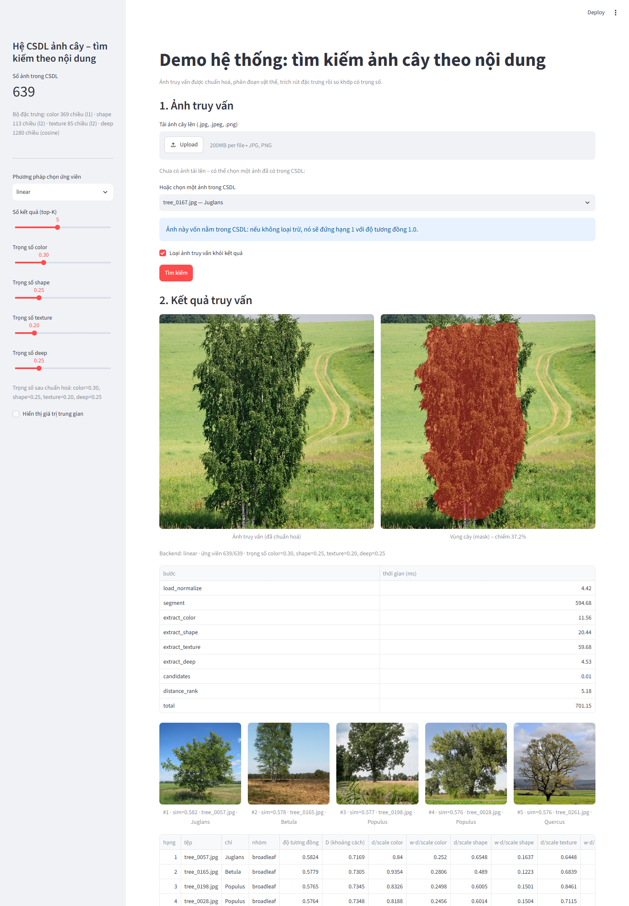
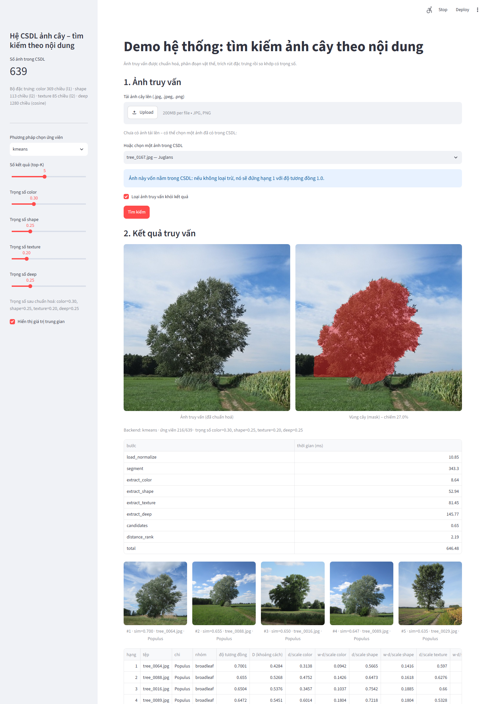

# Hướng dẫn sử dụng demo web – Hệ CSDL tìm kiếm ảnh cây theo nội dung

Tài liệu này hướng dẫn chạy và dùng giao diện web (Streamlit) của hệ thống. Chi tiết thiết kế, đặc trưng và
đánh giá xem trong `docs/BaoCao_HeCSDL_AnhCay.pdf`.

## 1. Yêu cầu

- Python 3.10 trở lên (đã thử với 3.12), Windows/Linux/macOS.
- Đã có sẵn trong repo: bộ ảnh `data/images/`, CSDL đặc trưng `db/tree_features.sqlite`, chỉ mục kd-tree và K-means.
- Lần chạy đầu cần Internet để tải model MobileNetV2 (≈14 MB) vào thư mục `models/`.
  Nếu không tải được, hệ thống vẫn chạy với 3 bộ đặc trưng thủ công (màu, hình dạng, kết cấu).

## 2. Cài đặt và khởi động

```bash
pip install -r requirements.txt
streamlit run app/streamlit_app.py
```

Trình duyệt tự mở địa chỉ `http://localhost:8501`. Nếu không tự mở, dán địa chỉ đó vào trình duyệt.
Muốn đổi cổng: `streamlit run app/streamlit_app.py --server.port 8600`.

Nếu màn hình báo "CSDL trống" thì chạy lại hai bước tạo CSDL rồi khởi động lại:

```bash
python scripts/extract_features.py
python scripts/build_index.py
```

## 3. Bố cục giao diện



**Thanh bên (trái)**

| Mục | Ý nghĩa |
|---|---|
| Số ảnh trong CSDL | số ảnh hiện có trong bảng `images` |
| Bộ đặc trưng | tên, số chiều và độ đo khoảng cách của từng bộ (color/L1, shape/L2, texture/L2, deep/cosine) |
| Phương pháp chọn ứng viên | `linear` (quét toàn bộ, chính xác nhất), `kdtree` (cây k-d trên PCA, nhanh), `kmeans` (chỉ quét các cụm gần nhất) |
| Số kết quả (top-K) | số ảnh trả về, mặc định 5 |
| Trọng số color / shape / texture / deep | mức ảnh hưởng của từng bộ đặc trưng; hệ thống tự chuẩn hoá để tổng bằng 1 |
| Hiển thị giá trị trung gian | bật để xem biểu đồ đặc trưng, bảng khoảng cách từng bộ và thông tin chỉ mục |

**Khu vực chính (phải)**

1. **Ảnh truy vấn**: tải ảnh lên hoặc chọn một ảnh có sẵn trong CSDL.
2. **Kết quả truy vấn**: ảnh đã chuẩn hoá, vùng cây tách được, bảng thời gian, 5 ảnh giống nhất và bảng số liệu.

## 4. Các bước truy vấn

### Cách 1: tải ảnh cây mới

1. Bấm **Upload**, chọn file `.jpg`, `.jpeg` hoặc `.png` (ảnh chụp ngang, một cây nằm giữa khung cho kết quả tốt nhất).
2. Bấm **Tìm kiếm**.
3. Đợi khoảng 0,5–1 giây (bước phân đoạn GrabCut chiếm phần lớn thời gian).

Ảnh không vuông sẽ được thu nhỏ theo cạnh ngắn và cắt giữa về 512×512 giống ảnh trong CSDL.
Mười ảnh thử không nằm trong CSDL có sẵn ở `data/queries/` để dùng ngay.

### Cách 2: chọn ảnh trong CSDL

1. Bỏ trống ô tải lên, chọn một ảnh trong danh sách **Hoặc chọn một ảnh trong CSDL** (30 ảnh ngẫu nhiên, có ghi chi nếu biết).
2. Giữ tick **Loại ảnh truy vấn khỏi kết quả** để ảnh đó không tự đứng hạng 1 với độ tương đồng 1.0.
3. Bấm **Tìm kiếm**.

### Đổi tham số

Sau khi đổi backend, top-K hoặc trọng số, giao diện nhắc "Tham số vừa thay đổi"; bấm **Tìm kiếm** lần nữa để chạy lại.

## 5. Đọc kết quả

- **Ảnh truy vấn (đã chuẩn hoá)** và **Vùng cây (mask)**: vùng đỏ là phần được coi là cây; tỉ lệ vùng cây hiển thị bên dưới.
  Nếu vùng đỏ lệch nhiều (bao cả cỏ, bỏ sót tán) thì kết quả các bộ hình dạng/kết cấu sẽ kém tin cậy.
- **Dòng Backend**: backend đang dùng, số ứng viên đã xét trên tổng số ảnh, trọng số đã chuẩn hoá.
- **Bảng thời gian (ms)**: từng bước load_normalize, segment, extract_*, candidates, distance_rank, total.
- **Hàng ảnh kết quả**: `#hạng · sim=độ tương đồng · tên file · chi`. Độ tương đồng `sim = 1/(1+D)` nằm trong (0, 1], càng gần 1 càng giống.
- **Bảng số liệu**: với mỗi ảnh kết quả
  - `độ tương đồng`, `D (khoảng cách)` = Σ trọng số × khoảng cách chuẩn hoá,
  - `d/scale <bộ>`: khoảng cách của bộ đó đã chia cho khoảng cách trung bình giữa hai ảnh ngẫu nhiên (≈1 là "bình thường", < 1 là giống hơn mức ngẫu nhiên),
  - `w·d/scale <bộ>`: phần đóng góp của bộ đó vào D.
- **Bảng chi tiết (text)**: cùng thông tin ở dạng văn bản để sao chép vào báo cáo.

## 6. Chế độ "Hiển thị giá trị trung gian"



Khi bật, phía dưới bảng kết quả có thêm:

- Hình **Giá trị đặc trưng trung gian của ảnh truy vấn**: biểu đồ HSV toàn cục, biểu đồ vật thể/nền, lưới hình dạng 8×8,
  profile bề rộng tán, đo vùng và tâm sai, biểu đồ LBP, hướng cạnh, hệ số DCT, GLCM và Tamura.
- Hình **Kết quả top-K** với cột chồng thể hiện đóng góp của từng bộ đặc trưng vào khoảng cách.
- Một mục mở rộng cho mỗi bộ đặc trưng chứa toàn bộ giá trị các khối (làm tròn 4 chữ số).
- Với backend `kdtree`: số chiều PCA, danh sách ứng viên và khoảng cách trong cây.
  Với backend `kmeans`: khoảng cách đến từng tâm cụm, các cụm đã quét và danh sách ứng viên.

## 7. Tham số trên URL (tiện cho demo)

| Tham số | Tác dụng | Ví dụ |
|---|---|---|
| `auto=<tên file trong data/queries>` | tự chạy truy vấn với ảnh đó ngay khi mở trang | `http://localhost:8501/?auto=query_01.jpg` |
| `backend=linear\|kdtree\|kmeans` | đặt backend mặc định | `?auto=query_03.jpg&backend=kmeans` |
| `debug=1` | bật sẵn "Hiển thị giá trị trung gian" | `?auto=query_03.jpg&backend=kmeans&debug=1` |

## 8. Dùng bằng dòng lệnh (không cần web)

```bash
python scripts/query.py --image data/queries/query_01.jpg --backend linear --top-k 5 \
    --weights color=0.3,shape=0.25,texture=0.2,deep=0.25 --json ketqua.json --fig ketqua.png
```

In bảng kết quả ra màn hình, ghi toàn bộ giá trị trung gian vào `ketqua.json` và vẽ hình `ketqua.png`.

## 9. Lỗi thường gặp

| Hiện tượng | Nguyên nhân / cách xử lý |
|---|---|
| Trang báo CSDL trống hoặc thiếu chỉ mục | chạy `python scripts/extract_features.py` rồi `python scripts/build_index.py`, khởi động lại |
| `Port 8501 is already in use` | thêm `--server.port <cổng khác>` |
| Thiếu bộ `deep` trong thanh bên | model chưa tải được (không có Internet); hệ thống vẫn chạy với 3 bộ còn lại, chạy lại `extract_features.py` khi có mạng |
| Vùng cây (mask) sai nhiều | ảnh không có cây rõ ở giữa hoặc nền quá giống tán; thử ảnh khác hoặc giảm trọng số shape/texture |
| Kết quả không đổi sau khi chỉnh trọng số | phải bấm lại **Tìm kiếm** |
| Ảnh tải lên bị mất sau khi tắt app | ảnh tạm được lưu ở `results/tmp/`, có thể xoá thoải mái |
